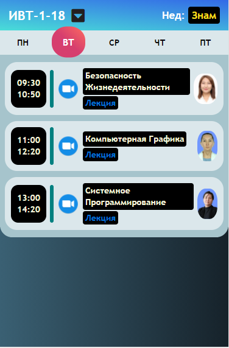

# Расписание для группы ИВТ-1-18
В период пандемии все уроки стали проводиться в онлайн режиме, каждая конференция имеют разную ссылку и разбросанны по разным группам в WhatsApp/Classroom
Искать ссылку на конференцию становится время затратно после спама в группах, чтобы решить эту проблему был собран ссылки на все конференции в одно место т.е в это страничку и эта страница доступно [этой ссылке](https://baktybek0v.github.io/ivt/)

Из дополнительных возмоностей страницы:

1. Отображение четность/нечетность недели 
2. Расписание экзаменов
3. Предупреждающие баннеры 
4. Какой нынешний или следующий пара

Имеют приятный дизайн

